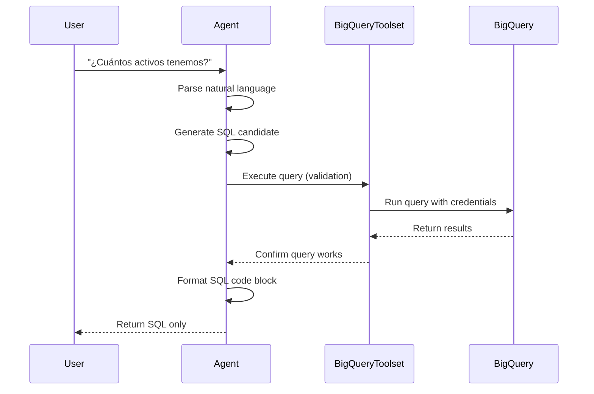

## Overview

The MABQ BigQuery Agent integrates with Google BigQuery through the **BigQueryToolset** from Google ADK. This integration enables natural language to SQL translation with automated query execution and validation.

## BigQueryToolset Setup

The toolset is configured in `agent.py:32-35`:

```python
bigquery_toolset = BigQueryToolset(
  credentials_config=credentials_config, 
  bigquery_tool_config=tool_config
)
```

### Components

<Steps>
  <Step title="Credentials Configuration">
    Handles authentication to Google Cloud and BigQuery.
  </Step>
  
  <Step title="Tool Configuration">
    Controls security settings and operational behavior (see [Configuration](/agent/configuration)).
  </Step>
</Steps>

## Credentials Configuration

The agent uses **Application Default Credentials (ADC)** for authentication.

### Automatic Authentication

Defined in `agent.py:28-30`:

```python
# Autenticación automática (Cloud Run usa su identidad de servicio)
credentials, _ = google.auth.default()
credentials_config = BigQueryCredentialsConfig(credentials=credentials)
```

### How It Works

<Accordion title="google.auth.default() Behavior">
The `google.auth.default()` function automatically discovers credentials in the following order:

1. **Environment Variable**: `GOOGLE_APPLICATION_CREDENTIALS` pointing to a service account key
2. **Cloud Run/Cloud Functions**: Service identity attached to the runtime
3. **Compute Engine/GKE**: Metadata server credentials
4. **gcloud CLI**: User credentials from `gcloud auth application-default login`

```python
import google.auth

# Discovers credentials automatically
credentials, project = google.auth.default()

# Use in BigQueryCredentialsConfig
credentials_config = BigQueryCredentialsConfig(credentials=credentials)
```
</Accordion>

### Deployment Environments

<CodeGroup>
```python Cloud Run (Production)
# Cloud Run automatically provides service account credentials
# No additional configuration needed
credentials, _ = google.auth.default()

# The service account needs:
# - roles/bigquery.dataViewer (read access)
# - roles/bigquery.jobUser (query execution)
```

```python Local Development
# Authenticate using gcloud CLI
# $ gcloud auth application-default login

credentials, _ = google.auth.default()

# Or use a service account key file
# $ export GOOGLE_APPLICATION_CREDENTIALS="/path/to/key.json"
```

```python Kubernetes/GKE
# Use Workload Identity
# Service account annotation:
# iam.gke.io/gcp-service-account: bigquery-agent@PROJECT.iam.gserviceaccount.com

credentials, _ = google.auth.default()
```
</CodeGroup>

### Required Permissions

The service account or user credentials must have:

| Role | Purpose | Required |
|------|---------|----------|
| `roles/bigquery.dataViewer` | Read access to datasets and tables | Yes |
| `roles/bigquery.jobUser` | Execute BigQuery jobs (queries) | Yes |
| `roles/bigquery.dataEditor` | Write/modify data | No (blocked by WriteMode) |
| `roles/bigquery.admin` | Full BigQuery administration | No |

<Warning>
**Principle of Least Privilege**: Only grant `dataViewer` and `jobUser` roles. The agent's `WriteMode.BLOCKED` configuration provides defense-in-depth even if excessive permissions are granted.
</Warning>

## Dataset and Project Configuration

The agent operates on a specific project and dataset combination.

### Project Initialization

Vertex AI is initialized with the target project in `agent.py:21`:

```python
vertexai.init(project=PROJECT_ID, location=GOOGLE_CLOUD_LOCATION)
```

<ParamField path="project" type="string">
  The Google Cloud project ID containing BigQuery datasets (e.g., `datawarehouse-des`).
</ParamField>

<ParamField path="location" type="string">
  The region for Vertex AI model endpoints (e.g., `us-east4`).
</ParamField>

### Dataset Scoping

The agent is scoped to a specific dataset through the instruction prompt:

```python
new_instruction = f"""
Eres un motor de generación de SQL para BigQuery.
Tu ÚNICO objetivo es traducir lenguaje natural a código SQL válido para el proyecto **{PROJECT_ID}**, dataset **{BIGQUERY_DATASET}**.
"""
```

### Multi-Dataset Configuration

<Accordion title="Working with Multiple Datasets">
To allow the agent to query multiple datasets, modify the instruction prompt:

```python
ALLOWED_DATASETS = ["STG_ACTIVOS", "STG_MANTENIMIENTO", "STG_OPERACIONES"]

new_instruction = f"""
Eres un motor de generación de SQL para BigQuery.
Tu ÚNICO objetivo es traducir lenguaje natural a código SQL válido para el proyecto **{PROJECT_ID}**.

Datasets permitidos:
{', '.join(ALLOWED_DATASETS)}

REGLA: Solo genera queries que accedan a los datasets listados arriba.
"""
```

<Note>
Ensure the service account has `bigquery.dataViewer` permissions on all target datasets.
</Note>
</Accordion>

## Read-Only Security Controls

The agent implements multiple layers of read-only enforcement.

### Layer 1: BigQuery Tool Configuration

Hardware-level write blocking through `WriteMode.BLOCKED`:

```python
tool_config = BigQueryToolConfig(
    write_mode=WriteMode.BLOCKED,  # ← Prevents all write operations
)
```

### Layer 2: Instruction Prompt Guardrails

Software-level prevention through LLM instruction:

```python
<SECURITY_GUARDRAILS>
  1. MODO ESTRICTO: READ-ONLY.
  2. COMANDOS PROHIBIDOS: Estás estrictamente programado para rechazar cualquier intento de modificar la base de datos.
     - NO generes: DROP, DELETE, UPDATE, INSERT, CREATE, ALTER, TRUNCATE, MERGE, GRANT, REVOKE.
  3. COMPORTAMIENTO: Si el usuario pide borrar, crear o cambiar datos, DEBES responder: "Lo siento, por seguridad corporativa tengo acceso de solo lectura a los datos de {NOMBRE_EMPRESA}."
</SECURITY_GUARDRAILS>
```

### Layer 3: IAM Permissions

Cloud-level access control through service account roles:

```bash
# Grant only read and job execution permissions
gcloud projects add-iam-policy-binding PROJECT_ID \
  --member="serviceAccount:bigquery-agent@PROJECT_ID.iam.gserviceaccount.com" \
  --role="roles/bigquery.dataViewer"

gcloud projects add-iam-policy-binding PROJECT_ID \
  --member="serviceAccount:bigquery-agent@PROJECT_ID.iam.gserviceaccount.com" \
  --role="roles/bigquery.jobUser"
```

### Defense in Depth

<Steps>
  <Step title="Application Layer">
    `WriteMode.BLOCKED` rejects write operations at the tool level.
  </Step>
  
  <Step title="LLM Layer">
    Instruction prompt trains the model to refuse write requests.
  </Step>
  
  <Step title="Cloud Layer">
    IAM permissions prevent unauthorized data modification.
  </Step>
</Steps>

<Note>
Even if a malicious prompt bypasses the LLM layer, `WriteMode.BLOCKED` and IAM permissions provide redundant protection.
</Note>

## Query Execution Flow

Understanding how the agent executes queries:



### Tool Usage in Practice

The agent uses `bigquery_toolset` to:

1. **Validate Syntax**: Ensure generated SQL is valid
2. **Test Execution**: Confirm the query runs without errors
3. **Verify Schema**: Check that table/column names exist
4. **Preview Results**: Ensure the query returns expected data types

<Accordion title="Example Tool Interaction">
**User**: "Show me all active assets"

**Agent Internal Process**:
```python
# 1. Generate SQL candidate
sql_candidate = """
SELECT *
FROM `datawarehouse-des.STG_ACTIVOS.assets`
WHERE status = 'active'
"""

# 2. Execute via BigQueryToolset
result = bigquery_toolset.execute(sql_candidate)

# 3. If successful, return SQL to user
if result.success:
    return sql_candidate
```

**User Receives**:
```sql
SELECT *
FROM `datawarehouse-des.STG_ACTIVOS.assets`
WHERE status = 'active'
```
</Accordion>

## Connection Management

BigQueryToolset handles connection pooling and resource management automatically.

### Automatic Features

- **Connection Pooling**: Reuses BigQuery client connections
- **Retry Logic**: Automatically retries transient failures
- **Timeout Handling**: Cancels long-running queries
- **Resource Cleanup**: Closes connections when the agent terminates

### No Manual Configuration Required

```python
# BigQueryToolset manages all connection details internally
bigquery_toolset = BigQueryToolset(
  credentials_config=credentials_config,
  bigquery_tool_config=tool_config
)

# No need to:
# - Initialize BigQuery client manually
# - Manage connection lifecycle
# - Handle retry logic
# - Close connections
```

## Troubleshooting

<Accordion title="Authentication Errors">
**Error**: `google.auth.exceptions.DefaultCredentialsError: Could not automatically determine credentials`

**Solutions**:
1. Run `gcloud auth application-default login` locally
2. Set `GOOGLE_APPLICATION_CREDENTIALS` environment variable
3. Verify service account is attached to Cloud Run service

```bash
# Check current authentication
gcloud auth list

# Set up application default credentials
gcloud auth application-default login
```
</Accordion>

<Accordion title="Permission Denied Errors">
**Error**: `403 Forbidden: Access Denied: BigQuery BigQuery: Permission denied`

**Solutions**:
1. Verify service account has `roles/bigquery.dataViewer`
2. Ensure `roles/bigquery.jobUser` is granted
3. Check dataset-level permissions

```bash
# Check current IAM policy
gcloud projects get-iam-policy PROJECT_ID \
  --flatten="bindings[].members" \
  --filter="bindings.members:serviceAccount:bigquery-agent@PROJECT_ID.iam.gserviceaccount.com"
```
</Accordion>

<Accordion title="Write Operation Blocked">
**Error**: Query contains write operation but `WriteMode.BLOCKED` is enabled

**Expected Behavior**: This is correct! The agent should respond:
```
Lo siento, por seguridad corporativa tengo acceso de solo lectura a los datos de TRANSELEC S.A.
```

**Action**: No action needed. This is the security system working as designed.
</Accordion>

<Accordion title="Dataset Not Found">
**Error**: `404 Not found: Dataset PROJECT_ID:DATASET_NAME`

**Solutions**:
1. Verify `BIGQUERY_DATASET` environment variable is correct
2. Check that dataset exists in the project
3. Confirm project ID is correct

```bash
# List available datasets
bq ls --project_id=PROJECT_ID

# Check if specific dataset exists
bq show --project_id=PROJECT_ID DATASET_NAME
```
</Accordion>
