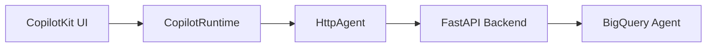
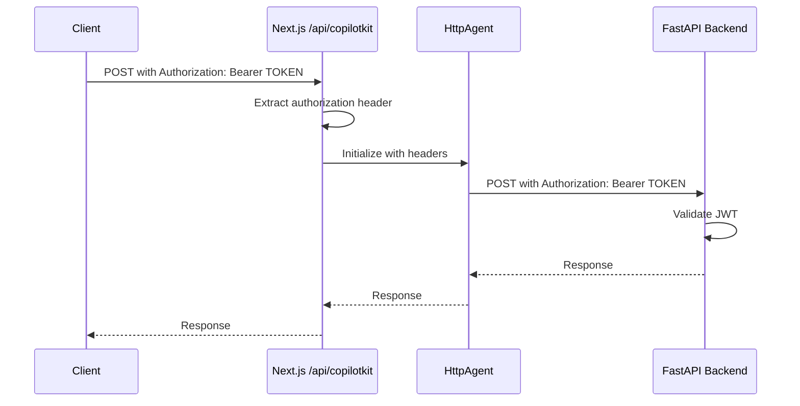

## Overview

The `HttpAgent` from `@ag-ui/client` is used to connect the CopilotKit frontend to the MABQ BigQuery Agent FastAPI backend. It handles HTTP communication and authorization header forwarding.

## Purpose

The HttpAgent serves as a bridge between:
- **Frontend**: CopilotKit chat interface in Next.js
- **Backend**: FastAPI application with the ADK agent



## Installation

```bash
npm install @ag-ui/client
```

## Basic Configuration

The HttpAgent is initialized with a backend URL and authentication headers:

```typescript
import { HttpAgent } from "@ag-ui/client";

const agent = new HttpAgent({ 
  url: BACKEND_URL,
  headers: {
    "Authorization": authHeader
  }
});
```

<ParamField path="url" type="string" required>
  The backend API endpoint URL
</ParamField>

<ParamField path="headers" type="object">
  HTTP headers to include in every request to the backend
</ParamField>

## Implementation in MABQ

In the MABQ project, the HttpAgent is configured in `app/api/copilotkit/route.ts`:

```typescript
import { HttpAgent } from "@ag-ui/client";
import { NextRequest } from "next/server";

const BACKEND_URL = process.env.NEXT_PUBLIC_API_URL || 
  "https://mabq-backend-1093163678323.us-east4.run.app";

export const POST = async (req: NextRequest) => {
  const authHeader = req.headers.get("authorization") || "";
  
  const runtime = new CopilotRuntime({
    agents: {
      default_agent: new HttpAgent({ 
        url: BACKEND_URL,
        headers: {
          "Authorization": authHeader
        }
      }),
    },
  });
  
  // ...
};
```

## Configuration Parameters

### URL Configuration

The backend URL is read from an environment variable with a fallback:

```typescript
const BACKEND_URL = process.env.NEXT_PUBLIC_API_URL || 
  "https://mabq-backend-1093163678323.us-east4.run.app";
```

<ParamField path="NEXT_PUBLIC_API_URL" type="string" required>
  Environment variable containing the backend API URL
</ParamField>

<Tip>
  Use `NEXT_PUBLIC_` prefix in Next.js to expose environment variables to the browser
</Tip>

### Headers Configuration

The most critical configuration is the Authorization header forwarding:

```typescript
const authHeader = req.headers.get("authorization") || "";

headers: {
  "Authorization": authHeader
}
```

<ParamField path="headers.Authorization" type="string" required>
  Azure AD Bearer token from the incoming request
</ParamField>

## Authorization Header Forwarding

The HttpAgent forwards the user's authentication token from the frontend request to the backend:



### Header Extraction

The authorization header is extracted from the incoming Next.js request:

```typescript
const authHeader = req.headers.get("authorization") || "";
```

### Header Forwarding

The header is then passed to the HttpAgent configuration:

```typescript
new HttpAgent({ 
  url: BACKEND_URL,
  headers: {
    "Authorization": authHeader
  }
})
```

<Warning>
  Every request from HttpAgent to the backend includes this Authorization header, ensuring the backend can authenticate and authorize the user.
</Warning>

## Request Flow

When a user sends a message through CopilotKit:

1. **Frontend**: User types message in chat UI
2. **CopilotKit**: Sends request to `/api/copilotkit` with Authorization header
3. **Next.js Route**: Extracts Authorization header from request
4. **HttpAgent**: Initialized with backend URL and Authorization header
5. **Backend Request**: HttpAgent forwards message to FastAPI with Authorization header
6. **Authentication**: FastAPI validates JWT token
7. **Agent Processing**: BigQuery agent processes the query
8. **Response**: Results flow back through the chain

## Environment Variables

Configure the HttpAgent with these environment variables:

### Frontend (.env.local)

```bash
NEXT_PUBLIC_API_URL=https://mabq-backend-1093163678323.us-east4.run.app
```

<ParamField path="NEXT_PUBLIC_API_URL" type="string" required>
  The URL of your deployed FastAPI backend
</ParamField>

## Error Handling

The HttpAgent will propagate errors from the backend:

### Backend Unreachable

```typescript
try {
  // HttpAgent attempts connection
} catch (error) {
  // Network error: ECONNREFUSED, ETIMEDOUT, etc.
}
```

### Authentication Failure (403)

```json
{
  "error": "Acceso Denegado. El token ha expirado."
}
```

### Backend Error (500)

```json
{
  "error": "Agent execution failed",
  "details": "..."
}
```

## Integration with CopilotRuntime

The HttpAgent is registered with CopilotRuntime as a named agent:

```typescript
const runtime = new CopilotRuntime({
  agents: {
    default_agent: new HttpAgent({ 
      url: BACKEND_URL,
      headers: {
        "Authorization": authHeader
      }
    }),
  },
});
```

<ParamField path="agents.default_agent" type="HttpAgent">
  The primary agent instance used by CopilotKit
</ParamField>

<Note>
  The key `default_agent` can be any string. CopilotKit will use this agent for all requests unless otherwise specified.
</Note>

## Multiple Agents

You can configure multiple HttpAgents for different backends:

```typescript
const runtime = new CopilotRuntime({
  agents: {
    bigquery_agent: new HttpAgent({ 
      url: BIGQUERY_BACKEND_URL,
      headers: { "Authorization": authHeader }
    }),
    analytics_agent: new HttpAgent({ 
      url: ANALYTICS_BACKEND_URL,
      headers: { "Authorization": authHeader }
    }),
  },
});
```

## Security Considerations

<Warning>
  **Critical Security Practices**:
  
  1. **Never hardcode tokens**: Always extract from request headers
  2. **Use HTTPS**: Ensure both frontend and backend use HTTPS
  3. **Validate backend URL**: Ensure `NEXT_PUBLIC_API_URL` points to your trusted backend
  4. **Token expiration**: Handle token refresh in the frontend
  5. **CORS configuration**: Backend must allow the frontend origin
</Warning>

### Example Security Setup

```typescript
// ✅ GOOD: Extract from request
const authHeader = req.headers.get("authorization") || "";

// ❌ BAD: Hardcoded token
const authHeader = "Bearer hardcoded_token_123";

// ✅ GOOD: Environment variable
const BACKEND_URL = process.env.NEXT_PUBLIC_API_URL;

// ❌ BAD: Hardcoded URL
const BACKEND_URL = "http://localhost:8000";
```

## Testing the HttpAgent

### Local Development

```bash .env.local
NEXT_PUBLIC_API_URL=http://localhost:8000
```

### Production

```bash .env.production
NEXT_PUBLIC_API_URL=https://mabq-backend-1093163678323.us-east4.run.app
```

### Verifying Connection

Check that the HttpAgent can reach the backend:

```typescript
console.log(`HttpAgent connecting to: ${BACKEND_URL}`);
console.log(`Authorization header: ${authHeader ? 'Present' : 'Missing'}`);
```

## Related Documentation

- [CopilotKit Endpoint](/api/copilotkit-endpoint) - API route implementation
- [Authentication](/api/authentication) - Backend JWT validation
- [FastAPI Endpoints](/api/fastapi-endpoints) - Backend API reference
- [Agent Interface](/api/agent-interface) - BigQuery agent configuration