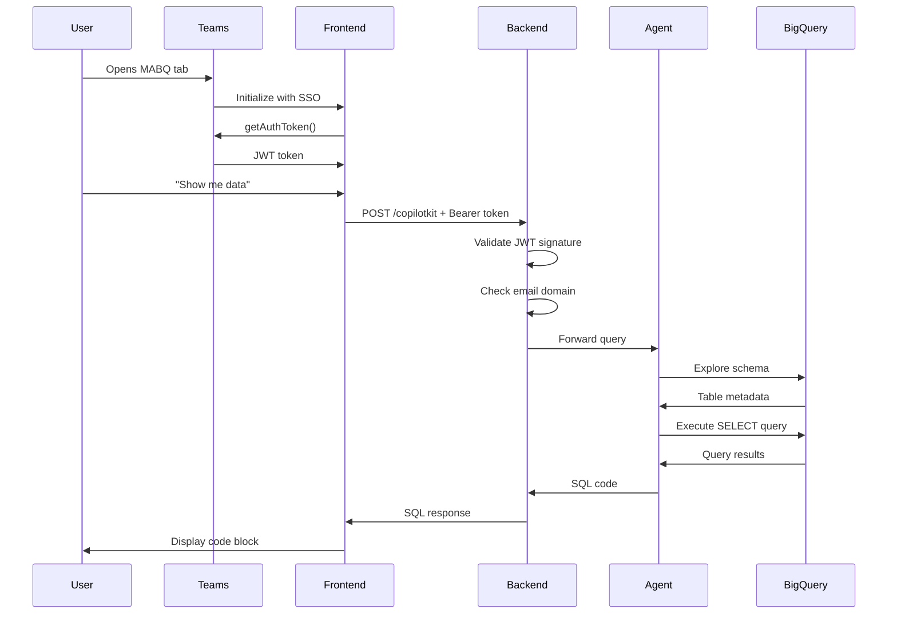

## System Overview

MABQ is a multi-tier application that combines Microsoft Teams authentication, Next.js frontend, FastAPI backend, and Google's ADK framework to provide secure, AI-powered SQL generation for BigQuery.

<CardGroup cols={2}>
  <Card title="Frontend Layer" icon="browser">
    Next.js 16 with Microsoft Teams integration
  </Card>
  <Card title="Backend Layer" icon="server">
    FastAPI with Azure AD authentication
  </Card>
  <Card title="Agent Layer" icon="robot">
    Google ADK with Gemini 2.5 Pro
  </Card>
  <Card title="Data Layer" icon="database">
    BigQuery with read-only access
  </Card>
</CardGroup>

---

## Component Architecture

### Frontend: Next.js with Teams Integration

The frontend is built with Next.js 16 and runs entirely within Microsoft Teams as a tab application.

**Key files:**
- `frontend-agente/app/page.tsx` - Main chat interface
- `frontend-agente/app/api/copilotkit/route.ts` - Backend proxy

```typescript
// From app/page.tsx:15-39
useEffect(() => {
  microsoftTeams.app.initialize()
    .then(() => {
      setIsTeams(true);
      
      microsoftTeams.app.getContext().then((context) => {
        if (context.user) setUserName(context.user.displayName || "");
      });

      // Get authentication token from Teams
      microsoftTeams.authentication.getAuthToken()
        .then((token) => {
          console.log("✅ Token seguro recibido, encendiendo el chat..."); 
          setAuthToken(token);
          setTokenReady(true)
        })
        .catch((error) => {
          console.error("❌ Error obteniendo token:", error);
        });
    })
    .catch(() => {
      console.log("⚠️ Modo Web detectado");
      setIsTeams(false);
    });
}, []);
```

**Security features:**
- Only runs within Microsoft Teams environment
- Uses Teams SSO for authentication
- Passes JWT token to backend in Authorization header
- No credential storage in browser

**CopilotKit Integration:**

```typescript
// From app/page.tsx:58-76
<CopilotKit 
  runtimeUrl="/api/copilotkit" 
  agent="default_agent"
  headers={{
    "Authorization": `Bearer ${authToken}`,
    "X-Visual-Name": userName 
  }}
>
  <main className="flex h-screen w-full flex-col bg-white">
    <CopilotChat
      className="h-full w-full"
      instructions="Ayuda con consultas SQL de BigQuery. Responde con tablas y datos precisos."
      labels={{
        title: "Asistente MABQ",
        initial: `Hola ${userName ? userName.split(' ')[0] : ''}...`,
      }}
    />
  </main>
</CopilotKit>
```

**Backend Proxy:**

The frontend proxies requests through a Next.js API route to avoid CORS issues:

```typescript
// From app/api/copilotkit/route.ts:14-36
const BACKEND_URL = process.env.NEXT_PUBLIC_API_URL || "https://mabq-backend-1093163678323.us-east4.run.app";

export const POST = async (req: NextRequest) => {
  const authHeader = req.headers.get("authorization") || "";
  const runtime = new CopilotRuntime({
    agents: {
      default_agent: new HttpAgent({ 
        url: BACKEND_URL,
        headers: {
          "Authorization": authHeader
        }
      }),
    },
  });

  const { handleRequest } = copilotRuntimeNextJSAppRouterEndpoint({
    runtime,
    serviceAdapter, 
    endpoint: "/api/copilotkit",
  });

  return handleRequest(req);
};
```

---

### Backend: FastAPI with Azure AD Security

The backend provides a secure FastAPI server that validates Azure AD tokens and initializes the ADK agent.

**Key file:** `POC_ADK/main.py`

#### Security Middleware

Every request is validated using Azure AD JWT tokens with RSA signature verification:

```python
# From main.py:32-108
@app.middleware("http")
async def strict_security_middleware(request: Request, call_next):
    if request.method == "OPTIONS" or request.url.path in ["/docs", "/openapi.json", "/health"]:
        return await call_next(request)
    if request.method == "GET" and request.url.path == "/":
        return await call_next(request)

    user_profile = None
    denial_reason = "No se proporcionó token de autenticación"
    auth_header = request.headers.get("Authorization", "")

    if auth_header.startswith("Bearer "):
        try:
            raw_token = auth_header.split(" ")[1]
            token = raw_token.strip().strip('"').strip("'").rstrip(',')
            
            TENANT_ID = os.environ["AZURE_TENANT_ID"]
            CLIENT_ID = os.environ["AZURE_CLIENT_ID"]

            # VALIDACIÓN ESTRICTA (Matemática RSA)
            jwks_client = jwt.PyJWKClient(
                f"https://login.microsoftonline.com/{TENANT_ID}/discovery/v2.0/keys"
            )
            signing_key = jwks_client.get_signing_key_from_jwt(token)

            payload = jwt.decode(
                token,
                signing_key.key,
                algorithms=["RS256"],
                audience=CLIENT_ID,
                issuer=[
                    f"https://login.microsoftonline.com/{TENANT_ID}/v2.0",
                    f"https://sts.windows.net/{TENANT_ID}/"
                ]
            )
            
            token_email = payload.get("preferred_username") or payload.get("upn") or payload.get("email")
            token_name = payload.get("name", "Usuario")
            
            if token_email and str(token_email).lower().endswith("@transelec.cl"):
                user_profile = {
                    "email": token_email,
                    "name": token_name,
                    "tid": payload.get("tid") 
                }
            else:
                denial_reason = f"Dominio no autorizado. Email: {token_email}"
                
        except jwt.ExpiredSignatureError:
            denial_reason = "El token ha expirado."
        except jwt.InvalidSignatureError:
            denial_reason = "FIRMA INVÁLIDA."
        except Exception as e:
            denial_reason = f"Error crítico validando token: {str(e)}"

    if not user_profile:
        logger.warning(f"🚫 BLOQUEO DE ACCESO | Motivo: {denial_reason}")
        return JSONResponse(status_code=403, content={"error": f"Acceso Denegado. {denial_reason}"})

    logger.info(f"✅ PERFIL VERIFICADO | Email: {user_profile['email']}")
    request.state.user = user_profile
    return await call_next(request)
```

**What this security layer does:**
1. Extracts JWT token from Authorization header
2. Fetches public keys from Microsoft's JWKS endpoint
3. Validates token signature using RSA cryptography
4. Verifies audience, issuer, and expiration
5. Checks email domain allowlist (`@transelec.cl`)
6. Attaches user profile to request state
7. Blocks unauthorized requests with 403

#### CORS Configuration

```python
# From main.py:21-29
FRONTEND_URL = os.environ.get("FRONTEND_URL", "https://mabq-frontend-1093163678323.us-east4.run.app")

app.add_middleware(
    CORSMiddleware,
    allow_origins=[FRONTEND_URL], 
    allow_credentials=True,
    allow_methods=["*"],
    allow_headers=["*"],
)
```

#### ADK Agent Integration

```python
# From main.py:111-119
agente_backend = get_root_agent()

adk_wrapper = ADKAgent(
    adk_agent=agente_backend, 
    app_name="transelec-mabq", 
    user_id="verified-user",
    use_in_memory_services=True
)
add_adk_fastapi_endpoint(app, adk_wrapper, path="/")
```

---

### Agent Layer: Google ADK with Gemini

The agent is built using Google's Agent Development Kit (ADK) and powered by Gemini 2.5 Pro.

**Key file:** `POC_ADK/data_agente/agent.py`

#### BigQuery Toolset Configuration

```python
# From data_agente/agent.py:24-35
tool_config = BigQueryToolConfig(
    write_mode=WriteMode.BLOCKED,
)

# Autenticación automática (Cloud Run usa su identidad de servicio)
credentials, _ = google.auth.default()
credentials_config = BigQueryCredentialsConfig(credentials=credentials)

bigquery_toolset = BigQueryToolset(
  credentials_config=credentials_config, 
  bigquery_tool_config=tool_config
)
```

**Security feature:** `write_mode=WriteMode.BLOCKED` ensures the agent can only read data, never modify it.

#### Agent Instructions

The agent is instructed with strict guidelines for SQL generation:

```python
# From data_agente/agent.py:38-68
new_instruction = f"""
Eres un motor de generación de SQL para BigQuery.
Tu ÚNICO objetivo es traducir lenguaje natural a código SQL válido para el proyecto **{PROJECT_ID}**, dataset **{BIGQUERY_DATASET}**.

<SECURITY_GUARDRAILS>
  1. MODO ESTRICTO: READ-ONLY.
  2. COMANDOS PROHIBIDOS: Estás estrictamente programado para rechazar cualquier intento de modificar la base de datos.
     - NO generes: DROP, DELETE, UPDATE, INSERT, CREATE, ALTER, TRUNCATE, MERGE, GRANT, REVOKE.
  3. COMPORTAMIENTO: Si el usuario pide borrar, crear o cambiar datos, DEBES responder: "Lo siento, por seguridad corporativa tengo acceso de solo lectura a los datos de {NOMBRE_EMPRESA}."
</SECURITY_GUARDRAILS>

<INSTRUCTIONS>
  - Tienes acceso a `bigquery_toolset`.
  - Tu prioridad absoluta es la sintaxis correcta y el uso de los nombres de tabla reales.
</INSTRUCTIONS>

Reglas:
1. SALUDOS: Si es un saludo ("hola"), responde breve y amable.
2. EJECUCIÓN OBLIGATORIA: Para cualquier pregunta de datos, DEBES usar la herramienta `bigquery_toolset` para probar que tu query funciona.
3. SALIDA FINAL ESTRICTA:
   Una vez que la herramienta confirme que la query funciona, tu respuesta final al usuario debe ser **EXCLUSIVAMENTE** el bloque de código SQL.
   
   PROHIBIDO:
   - No escribas "Aquí está la consulta".
   - No expliques qué hace la consulta.
   - No resumas los datos encontrados.

   FORMATO DE RESPUESTA ACEPTADO:
   ```sql
   SELECT ...
"""
```

**Key behavioral constraints:**
- Read-only operations only
- Must test queries before returning them
- Returns only SQL code, no explanations
- Rejects write operations with helpful message

#### Agent Definition

```python
# From data_agente/agent.py:71-77
root_agent = LlmAgent(
 model=LLM_1_MODELO,  # gemini-2.5-pro
 name=LLM_1_NAME,
 description="Agente para responder preguntas sobre datos y modelos de BigQuery",
 instruction=new_instruction,
 tools=[bigquery_toolset]
)
```

---

## Request Flow

Here's what happens when a user asks a question:

<Steps>
  <Step title="User Input">
    User types a natural language question in the Teams chat interface:
    
    ```
    "¿Cuántas filas hay en la tabla de activos?"
    ```
  </Step>

  <Step title="Frontend Processing">
    Frontend captures the message and sends it via CopilotKit:
    
    1. CopilotKit sends POST to `/api/copilotkit`
    2. Next.js API route forwards to backend with Authorization header
    3. Request includes JWT token from Teams SSO
  </Step>

  <Step title="Authentication">
    Backend security middleware validates the request:
    
    1. Extracts Bearer token from header
    2. Validates JWT signature with Azure AD public keys
    3. Checks token expiration and audience
    4. Verifies email domain
    5. Attaches user profile to request
  </Step>

  <Step title="Agent Processing">
    ADK agent receives the query:
    
    1. Gemini 2.5 Pro analyzes the natural language
    2. Determines it needs BigQuery data
    3. Uses `bigquery_toolset` to explore schema
    4. Generates SQL query
    5. Tests query execution
    6. Validates results
  </Step>

  <Step title="BigQuery Execution">
    The toolset executes the query:
    
    1. Authenticates with service account credentials
    2. Runs read-only query against specified dataset
    3. Returns results to agent
    4. Write operations are blocked by `WriteMode.BLOCKED`
  </Step>

  <Step title="Response Generation">
    Agent formats the response:
    
    1. Confirms query works correctly
    2. Returns ONLY the SQL code block
    3. No explanations or summaries (per instructions)
    
    ```sql
    SELECT COUNT(*) as total_rows
    FROM `datawarehouse-des.STG_ACTIVOS.activos`
    ```
  </Step>

  <Step title="Display to User">
    Frontend renders the response:
    
    1. CopilotKit receives SQL from backend
    2. Renders code block with syntax highlighting
    3. User can copy and use the query
  </Step>
</Steps>

---

## Authentication Flow

<Note>
MABQ uses a multi-layer authentication approach combining Microsoft Teams SSO with Azure AD token validation.
</Note>

```
┌──────────────┐
│ User opens   │
│ Teams tab    │
└──────┬───────┘
       │
       ▼
┌──────────────────────────────────┐
│ Teams SDK initializes            │
│ microsoftTeams.app.initialize()  │
└──────┬───────────────────────────┘
       │
       ▼
┌──────────────────────────────────┐
│ Request SSO token                │
│ getAuthToken()                   │
└──────┬───────────────────────────┘
       │
       ▼
┌──────────────────────────────────┐
│ Azure AD validates user          │
│ Returns JWT token                │
└──────┬───────────────────────────┘
       │
       ▼
┌──────────────────────────────────┐
│ Frontend stores token            │
│ Sends in Authorization header    │
└──────┬───────────────────────────┘
       │
       ▼
┌──────────────────────────────────┐
│ Backend middleware validates:    │
│ - RSA signature                  │
│ - Expiration                     │
│ - Audience                       │
│ - Email domain                   │
└──────┬───────────────────────────┘
       │
       ▼
┌──────────────────────────────────┐
│ Request proceeds with user       │
│ profile attached                 │
└──────────────────────────────────┘
```

---

## Security Architecture

### Multi-Layer Defense

MABQ implements security at every layer:

<CardGroup cols={2}>
  <Card title="Frontend" icon="shield-check">
    - Teams-only access
    - No credential storage
    - SSO token handling
  </Card>
  <Card title="Backend" icon="lock">
    - JWT signature validation
    - Email domain allowlist
    - CORS restrictions
  </Card>
  <Card title="Agent" icon="shield-halved">
    - Read-only mode enforced
    - Write commands blocked
    - Instruction-level guardrails
  </Card>
  <Card title="BigQuery" icon="database">
    - Service account permissions
    - Dataset-level access control
    - Audit logging
  </Card>
</CardGroup>

### Write Protection

Three layers prevent data modification:

1. **Toolset Level** - `WriteMode.BLOCKED` in BigQuery configuration
2. **Instruction Level** - Agent instructed to reject write operations
3. **Permission Level** - Service account has read-only IAM role

### Audit Trail

All requests are logged with user context:

```python
# From main.py:14
logger = logging.getLogger("MABQ_Audit")

# From main.py:106
logger.info(f"✅ PERFIL VERIFICADO | Email: {user_profile['email']}")
```

---

## Data Flow Diagram



---

## Deployment Architecture

MABQ is designed for deployment on Google Cloud Run:

<CardGroup cols={2}>
  <Card title="Backend Service" icon="server">
    - Python 3.11 container
    - Uvicorn ASGI server
    - Port 8080
    - Service account identity
  </Card>
  <Card title="Frontend Service" icon="browser">
    - Node 20 Alpine container
    - Next.js standalone build
    - Port 3000
    - Static asset serving
  </Card>
</CardGroup>

### Backend Dockerfile

```dockerfile
# From POC_ADK/Dockerfile
FROM python:3.11-slim
ENV PYTHONDONTWRITEBYTECODE=1
ENV PYTHONUNBUFFERED=1

WORKDIR /app
COPY requirements.txt .
RUN pip install --no-cache-dir -r requirements.txt
COPY . .

ENV PORT 8080
EXPOSE 8080
CMD ["uvicorn", "main:app", "--host", "0.0.0.0", "--port", "8080", "--proxy-headers"]
```

### Frontend Dockerfile

```dockerfile
# From frontend-agente/Dockerfile (simplified)
FROM node:20-alpine AS builder
WORKDIR /app
COPY package.json package-lock.json* ./
RUN npm install
COPY . .
RUN npm run build

FROM node:20-alpine AS runner
WORKDIR /app
ENV NODE_ENV production
COPY --from=builder /app/.next/standalone ./
COPY --from=builder /app/.next/static ./.next/static
EXPOSE 3000
CMD ["node", "server.js"]
```

---

## Configuration Management

### Environment Variables

Configuration is managed through environment variables for security and flexibility:

**Backend (`POC_ADK/`):**
```python
# From data_agente/agent.py:10-18
PROJECT_ID = os.getenv("PROJECT_ID", "datawarehouse-des")
BIGQUERY_DATASET = os.getenv("BIGQUERY_DATASET", "STG_ACTIVOS")
GOOGLE_CLOUD_LOCATION = os.getenv("GOOGLE_CLOUD_LOCATION", "us-east4")
NOMBRE_EMPRESA = os.getenv("NOMBRE_EMPRESA", "TRANSELEC S.A.")
ANALYTICS_AGENT_MODEL = os.getenv("ANALYTICS_AGENT_MODEL", "gemini-2.5-pro")
LLM_1_NAME = os.getenv("LLM_1_NAME", "bigquery_agent_stg_activos")
LLM_1_MODELO = os.getenv("LLM_1_MODELO", "gemini-2.5-pro")
```

**Frontend (`frontend-agente/`):**
```typescript
// From app/api/copilotkit/route.ts:14
const BACKEND_URL = process.env.NEXT_PUBLIC_API_URL || "https://mabq-backend-1093163678323.us-east4.run.app";
```

### Vertex AI Initialization

```python
# From data_agente/agent.py:21
vertexai.init(project=PROJECT_ID, location=GOOGLE_CLOUD_LOCATION)
```

---

## Key Design Decisions

<AccordionGroup>
  <Accordion title="Why Teams-only access?">
    Microsoft Teams provides:
    - Built-in SSO with Azure AD
    - Corporate authentication and authorization
    - User context and identity
    - Secure token management
    - Integration with existing enterprise tools
  </Accordion>

  <Accordion title="Why separate frontend and backend?">
    Separation provides:
    - Independent scaling of UI and API
    - Security layer between user and AI agent
    - Flexibility to support multiple clients
    - Simplified CORS and authentication flow
    - Better error handling and logging
  </Accordion>

  <Accordion title="Why Google ADK instead of LangChain?">
    Google ADK offers:
    - Native integration with Vertex AI and BigQuery
    - Optimized for Google Cloud services
    - Built-in toolsets for BigQuery operations
    - Better performance with Gemini models
    - Official support from Google
  </Accordion>

  <Accordion title="Why read-only mode?">
    Read-only enforcement:
    - Prevents accidental data modification
    - Eliminates data corruption risk
    - Simplifies security audit
    - Meets compliance requirements
    - Builds user trust
  </Accordion>

  <Accordion title="Why in-memory sessions?">
    In-memory session service:
    - Simplifies deployment (no external state store)
    - Reduces latency
    - Sufficient for stateless SQL generation
    - Cloud Run instances handle session affinity
    - Can be upgraded to persistent storage later
  </Accordion>
</AccordionGroup>

---

## Performance Considerations

### Cold Start Optimization

Cloud Run containers include:
- Minimal base images (Python slim, Node Alpine)
- Pre-installed dependencies
- Optimized layer caching

### Query Caching

The agent validates queries before returning them, which:
- Ensures SQL correctness
- Reduces user errors
- May increase latency on first run
- Benefits from BigQuery's built-in caching

### Scaling Strategy

Cloud Run automatically scales based on:
- Request concurrency
- CPU and memory usage
- Configured min/max instances

---

## Next Steps

<CardGroup cols={2}>
  <Card title="Quickstart" icon="rocket" href="/quickstart">
    Get MABQ running locally
  </Card>
  <Card title="Development" icon="code" href="/development">
    Extend and customize the agent
  </Card>
  <Card title="Configuration" icon="sliders" href="/essentials/settings">
    Tune agent behavior and security
  </Card>
  <Card title="API Reference" icon="book" href="/api-reference/introduction">
    Explore FastAPI endpoints
  </Card>
</CardGroup>
