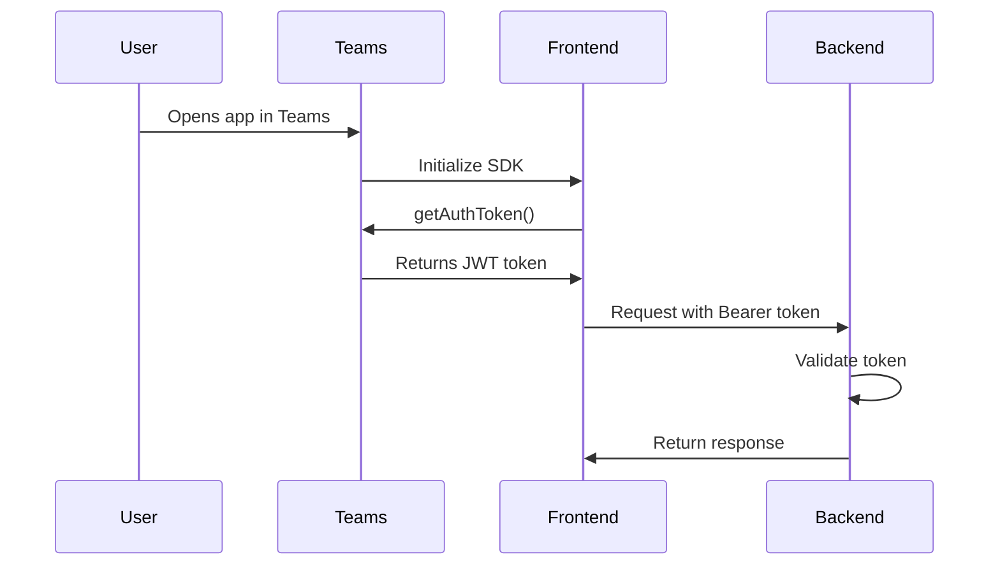

The MABQ BigQuery Agent is designed exclusively for Microsoft Teams. It uses the Teams JavaScript SDK for authentication, user context, and access control.

## Why Teams-Only?

The application enforces Teams-only access for several reasons:

<CardGroup cols={2}>
  <Card title="SSO Authentication" icon="lock">
    Teams provides built-in Single Sign-On (SSO) tokens for secure authentication
  </Card>
  <Card title="User Context" icon="user">
    Access to user display name, email, and organizational context
  </Card>
  <Card title="Enterprise Security" icon="shield">
    Leverages Microsoft's enterprise-grade security infrastructure
  </Card>
  <Card title="Seamless UX" icon="sparkles">
    No separate login required - uses existing Teams session
  </Card>
</CardGroup>

## Teams SDK Setup

The frontend uses `@microsoft/teams-js` v2.48.1 for Teams integration:

<CodeGroup>
```json package.json
{
  "dependencies": {
    "@microsoft/teams-js": "^2.48.1"
  }
}
```
</CodeGroup>

## Initialization Flow

The Teams SDK is initialized in the main page component's `useEffect` hook:

<CodeGroup>
```tsx app/page.tsx
import * as microsoftTeams from "@microsoft/teams-js";

export default function Home() {
  const [authToken, setAuthToken] = useState<string>("");
  const [userName, setUserName] = useState<string>("");
  const [isTeams, setIsTeams] = useState<boolean | null>(null); 
  const [tokenReady, setTokenReady] = useState<boolean>(false);

  useEffect(() => {
    microsoftTeams.app.initialize()
      .then(() => {
        setIsTeams(true);
        
        microsoftTeams.app.getContext().then((context) => {
          if (context.user) setUserName(context.user.displayName || "");
        });

        // token
        microsoftTeams.authentication.getAuthToken()
          .then((token) => {
            console.log(" Token seguro recibido, encendiendo el chat..."); 
            setAuthToken(token);
            setTokenReady(true)
          })
          .catch((error) => {
            console.error(" Error obteniendo token:", error);
          });
      })
      .catch(() => {
        console.log(" Modo Web detectado");
        setIsTeams(false);
      });
  }, []);
}
```
</CodeGroup>

## State Management

The component tracks four key states:

| State | Type | Purpose |
|-------|------|----------|
| `authToken` | `string` | Stores the Teams SSO token for backend authentication |
| `userName` | `string` | User's display name from Teams context |
| `isTeams` | `boolean \| null` | `null` = checking, `true` = in Teams, `false` = not in Teams |
| `tokenReady` | `boolean` | `true` when authentication token is successfully retrieved |

## Authentication Token Flow

<Steps>
  <Step title="Initialize Teams SDK">
    ```ts
    microsoftTeams.app.initialize()
    ```
    Attempts to initialize the Teams SDK. This Promise resolves if running inside Teams, and rejects if running in a browser.
  </Step>

  <Step title="Get User Context">
    ```ts
    microsoftTeams.app.getContext().then((context) => {
      if (context.user) setUserName(context.user.displayName || "");
    });
    ```
    Retrieves the user's Teams context including:
    - Display name
    - Email address
    - User principal name (UPN)
    - Tenant ID
  </Step>

  <Step title="Request Authentication Token">
    ```ts
    microsoftTeams.authentication.getAuthToken()
      .then((token) => {
        console.log(" Token seguro recibido, encendiendo el chat..."); 
        setAuthToken(token);
        setTokenReady(true)
      })
    ```
    Requests an SSO token from Teams. This token is a JWT that contains:
    - User identity
    - Tenant information
    - Expiration time
    - Signature for validation
  </Step>

  <Step title="Handle Errors">
    ```ts
    .catch((error) => {
      console.error(" Error obteniendo token:", error);
    });
    ```
    Logs any errors during token retrieval (e.g., user declined consent)
  </Step>
</Steps>

<Note>
  The `getAuthToken()` method may prompt the user for consent the first time the app is used. Subsequent calls use the cached consent.
</Note>

## Access Control

The app enforces strict access control based on the Teams detection:

### Non-Teams Environment

If Teams initialization fails (`isTeams === false`), the app displays a restriction message:

<CodeGroup>
```tsx app/page.tsx
if (isTeams === false) {
  return (
    <div className="flex h-screen items-center justify-center bg-red-50 text-red-600 font-semibold">
       Acceso Restringido. Esta app solo funciona dentro de Microsoft Teams.
    </div>
  );
}
```
</CodeGroup>

<Warning>
  Users attempting to access the application directly via browser will see this restriction message. The app will NOT function outside of Teams.
</Warning>

### Loading State

While checking for Teams or waiting for the authentication token:

<CodeGroup>
```tsx app/page.tsx
if (isTeams === null || !tokenReady) {
  return (
    <div className="flex h-screen flex-col items-center justify-center bg-gray-50">
      <div className="w-8 h-8 border-4 border-blue-600 border-t-transparent rounded-full animate-spin mb-4"></div>
      <p className="text-lg text-gray-600 font-medium">Autenticando de forma segura...</p>
    </div>
  );
}
```
</CodeGroup>

This loading screen displays:
- A spinning blue loader (CSS animation)
- A status message indicating secure authentication

## Token Usage

Once the token is retrieved, it's passed to CopilotKit:

<CodeGroup>
```tsx app/page.tsx
<CopilotKit 
  runtimeUrl="/api/copilotkit" 
  agent="default_agent"
  headers={{
    "Authorization": `Bearer ${authToken}`,
    "X-Visual-Name": userName 
  }}
>
  {/* ... */}
</CopilotKit>
```
</CodeGroup>

### Header Forwarding

<Steps>
  <Step title="Authorization Header">
    ```ts
    "Authorization": `Bearer ${authToken}`
    ```
    The Teams SSO token is sent as a Bearer token in the Authorization header. The backend validates this token to ensure:
    - The token is not expired
    - The token signature is valid
    - The user has access to the application
  </Step>

  <Step title="X-Visual-Name Header">
    ```ts
    "X-Visual-Name": userName
    ```
    The user's display name is sent as a custom header. The backend can use this for:
    - Personalized responses
    - Audit logging
    - User analytics
  </Step>
</Steps>

## Token Lifecycle



### Token Expiration

<Note>
  Teams SSO tokens typically expire after 1 hour. The frontend does NOT currently implement token refresh. Users may need to reload the app after extended sessions.
</Note>

## Error Handling

Common error scenarios:

| Error | Cause | Resolution |
|-------|-------|------------|
| Teams initialization fails | App opened in browser | Display access restriction message |
| `getAuthToken()` fails | User declined consent | Log error, prompt user to retry |
| Token validation fails | Expired or invalid token | Backend returns 401, user must reload app |

### Future Enhancement: Token Refresh

```tsx
// Not currently implemented
const refreshToken = async () => {
  const newToken = await microsoftTeams.authentication.getAuthToken();
  setAuthToken(newToken);
};

// Could be called on 401 response or before token expiration
```

## Teams Context Properties

The `getContext()` method provides rich user and environment information:

<Tabs>
  <Tab title="User Properties">
    ```ts
    context.user.displayName   // "John Doe"
    context.user.userPrincipalName  // "john.doe@company.com"
    context.user.id            // User object ID
    ```
  </Tab>
  
  <Tab title="Tenant Properties">
    ```ts
    context.user.tenant.id     // Tenant/organization ID
    context.user.tenant.teamsSku  // Teams SKU (E3, E5, etc.)
    ```
  </Tab>
  
  <Tab title="Environment Properties">
    ```ts
    context.app.locale         // "en-US"
    context.app.theme          // "default" | "dark" | "contrast"
    context.page.id            // Current page/tab ID
    ```
  </Tab>
</Tabs>

<Note>
  Currently, the app only uses `displayName`. Future enhancements could leverage other context properties for localization, theming, or analytics.
</Note>

## Security Considerations

<Warning>
  **Token Storage**: The SSO token is stored in React state (memory only) and is NOT persisted to localStorage or cookies. This prevents token theft via XSS attacks.
</Warning>

<Warning>
  **HTTPS Required**: Teams apps must be served over HTTPS. The Teams SDK will fail to initialize on insecure connections.
</Warning>

<Note>
  **Token Validation**: The backend MUST validate the token signature and claims. Never trust the token without validation.
</Note>

## Testing Outside Teams

For local development without Teams:

1. **Mock the Teams SDK** (not recommended for production):
   ```ts
   if (process.env.NODE_ENV === 'development') {
     // Mock initialization
     setIsTeams(true);
     setAuthToken('mock-token-for-dev');
     setUserName('Dev User');
     setTokenReady(true);
   }
   ```

2. **Use Teams Toolkit** (recommended):
   - Install Teams Toolkit VS Code extension
   - Use "Preview in Teams" to test in real Teams environment

<Warning>
  Never deploy mock authentication to production. Always enforce real Teams authentication in deployed environments.
</Warning>

## Next Steps

<CardGroup cols={2}>
  <Card title="CopilotKit Integration" icon="robot" href="/frontend/copilotkit-integration">
    Learn how the token is used in backend requests
  </Card>
  <Card title="Backend Authentication" icon="lock" href="/backend/authentication">
    Understand how the backend validates Teams tokens
  </Card>
</CardGroup>
